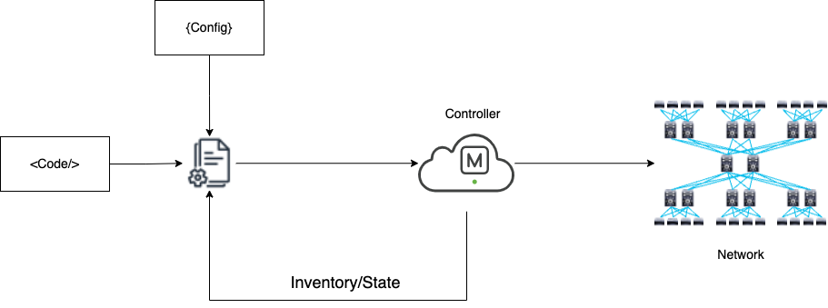

# Meraki-As-Code

## Background

The **Meraki-As-Code** repository provides a streamlined procedure for configuring a Meraki network using Infrastructure as Code (IaC) tools such as Terraform, Ansible, and Python. The primary goal is to separate the configuration data—which represents the state and settings of your network—from the configuration code that applies these settings. This approach enables you to leverage multiple tools in parallel, allowing each to excel at the tasks it handles best, without being limited by the delivery mechanism.

## Benefits of Meraki IaC

### Cloud Controller

A cloud controller significantly enhances IaC automation by presenting the entire network through a single, unified API. This centralization offers several advantages:
- **Simplified Management:** Instead of managing individual devices separately, the cloud controller provides a comprehensive view of the network.
- **Efficient Updates:** It can push out configuration changes directly to end devices, reducing the overhead on your automation tools.
- **Centralized Control:** Having one point of management ensures that all devices receive consistent updates, improving network reliability.

### Dynamic Inventory

Effective automation depends on having an accurate and current inventory of network devices. Traditionally, maintaining this inventory would require manual updates or frequent discovery processes. However, with a cloud controller:
- **Continuous Updates:** Every device sends telemetry data and receives configuration updates via the cloud, ensuring the inventory is always current.
- **Reduced Manual Effort:** The need to manually update or discover devices is minimized, which simplifies management and reduces the risk of errors.
- **Improved Accuracy:** A dynamic inventory means your automation tools always work with the most recent data, leading to more precise configuration management.

## Configuration Data

This repository uses a **model-based configuration** approach. This means that an abstract data model is used to generate the configuration settings for your network. The benefits of this approach include:
- **Flexibility:** By abstracting the configuration data, you can easily adapt the same data model to different environments or use cases.
- **Reusability:** The abstract model allows you to reuse configuration components across various scenarios, reducing duplication of effort.
- **Simplified Management:** Since the primary focus is on network configuration, the abstract data model makes it easier to manage and update settings consistently across your network.

## Configuration Management

While it is not mandatory to store configuration data in a Source Control Management (SCM) system like Git, doing so offers significant benefits:
- **Backup:** Maintain a history of your configuration data to recover previous states if necessary.
- **Drift Detection:** Monitor and detect any deviations between the intended configuration and what is actually deployed.
- **Audit Trail:** Keep a detailed record of who changed what and when, which is crucial for accountability and troubleshooting.

## Flow Overview


## Workspaces

This repository also introduces the concept of **workspaces**. Workspaces allow you to manage different contexts or environments (such as development, staging, and production) within the same codebase. This separation enables:
- **Environment Isolation:** Each workspace can be configured independently, ensuring that changes in one environment do not inadvertently affect another.
- **Parallel Development:** Teams can work on different environments simultaneously, which improves efficiency and reduces deployment risks.
- **Clear Organization:** Workspaces provide a structured approach to managing multiple configurations, making it easier to track and implement environment-specific settings.


## Repo layout
```
.
├── LICENSE
├── README.md
├── mac-data
│   ├── cpn-gov.yaml
│   ├── cpn.yaml
│   └── dcloud.yaml
├── terraform
│   ├── backend.tf
│   ├── debug
│   │   ├── main.tf
│   ├── main.tf
│   └── wireless
│       ├── main.tf
│       ├── meraki
│       │   └── main.tf
│       └── wlc
│           └── main.tf
├── mac.drawio
├── requirements.txt
```

All of the data is kept in the `mac-data` directory at the root level of the repo.  This allow other tooling
outside of terraform to access it.  Within the terraform directory, the tooling is separated by area (e.g. wireless, SD-WAN), etc.)


## How To

** Note: Add SSID data from file **

### Configuration Data
The first step is to is to manage the data in the `mac-data` directory for the workspace that you are wanting
to chance.

```
meraki_base_url: "https://api.meraki.com/api/v1"
meraki_org_id: 618681998810021964
meraki_network_tags: ["tf_test"]
ssids:
    - number: 1
      name: "PSeudoCo-P101-CORP"
      profile: "CORP_SSID"
      enabled: true
      authMode: psk
      psk: "C1sco12345!"
      # encryptionMode: wpa-eap
      wpaEncryptionMode: WPA2 only
      ipAssignmentMode: Bridge mode
      useVlanTagging: false
      vlanId: 11
      visible: true
```


# Wireless Configuration with Terraform

This document outlines how to deploy the wireless configuration using Terraform. The configuration files are located in the `terraform/wireless` directory. Below are the prerequisites, steps to initialize, plan, and apply the configuration, as well as troubleshooting tips.

## Prerequisites

- **Terraform Installation**:  
  Ensure that Terraform is installed on your system. You can download it from [terraform.io](https://www.terraform.io/downloads.html).

- **Access Credentials and Permissions**:  
  Verify that you have the necessary credentials (e.g., API keys, environment variables) and permissions to push changes to your wireless infrastructure.

- **Environment Setup**:  
  Confirm that your local or CI/CD environment is correctly configured to access the target infrastructure (this might include VPN access, proper network routes, etc.).

- **Directory Structure**:  
  Ensure you are in the root of your project repository. The wireless Terraform configurations should reside in the `terraform/wireless` directory.

## Initializing Terraform

Before you can deploy any changes, initialize the Terraform working directory to download the required plugins and set up the backend:

```bash
cd terraform/wireless
terraform init
```

This command prepares your working directory by installing the necessary provider plugins and configuring the backend (if defined).

## Planning the Deployment
Run a Terraform plan to preview the changes that will be made. This step is crucial to ensure that the planned modifications meet your expectations:

```bash
terraform plan
```

Review the output carefully. Terraform will display a detailed plan showing which resources will be added, changed, or destroyed. This helps in verifying that the changes are intentional and correct.

## Applying the Configuration
After reviewing the plan and confirming that the changes are as expected, apply the configuration to push out the wireless settings:

```bash
terraform apply
```

Terraform will prompt you to confirm before making any changes. Type yes to proceed. The command then implements the changes specified in your configuration files.

## Troubleshooting
If you encounter issues during the initialization, planning, or application stages, consider the following troubleshooting steps:

### Review Error Messages:
Check the error output carefully. Terraform error messages often provide guidance on what went wrong.

### Validate the Configuration:
Use the command below to validate the syntax and configuration of your Terraform files:

```bash
terraform validate
```

### State File Verification:
Ensure that the Terraform state file is not corrupted and is in sync with your remote resources. A misconfigured state file can lead to unexpected behavior.

### Plugin and Provider Updates:
If you suspect an issue with a plugin or provider, run:

```bash
terraform init -upgrade
```

This will upgrade the plugins to their latest compatible versions.

### Version Compatibility:
Make sure your Terraform version is compatible with the configuration files. Sometimes, upgrading or downgrading Terraform can resolve version-related issues.

### Consult Documentation and Community Resources:
Refer to the Terraform documentation for further details on error messages and configurations. Community forums and GitHub issues can also provide additional insights.

### Additional Considerations
#### Backup
Always backup your Terraform state file before applying significant changes.

#### Version Control

Use a version control system like Git to manage your configuration files, enabling easy rollback if necessary.

#### Testing Environment
Whenever possible, test configuration changes in a staging environment before applying them to production.
By following these guidelines, you can effectively manage and deploy your wireless configuration using Terraform. If you encounter persistent issues, consult the Terraform community or open an issue in the repository for further assistance.

