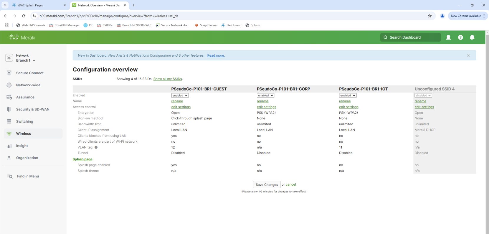
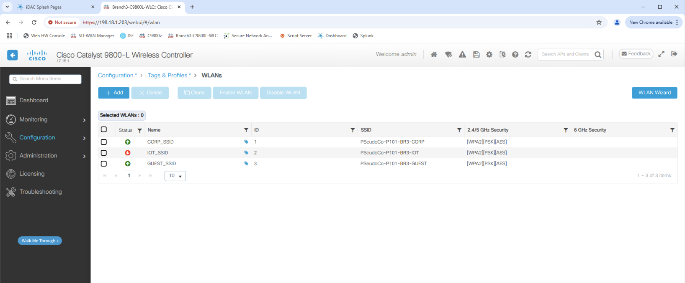
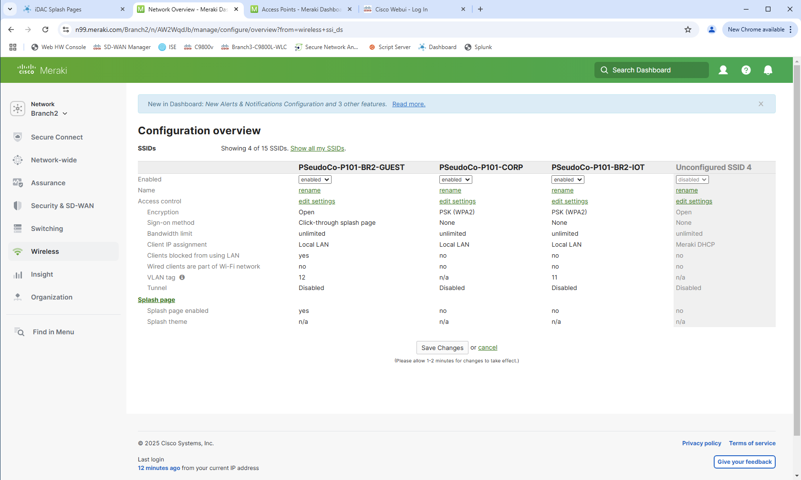
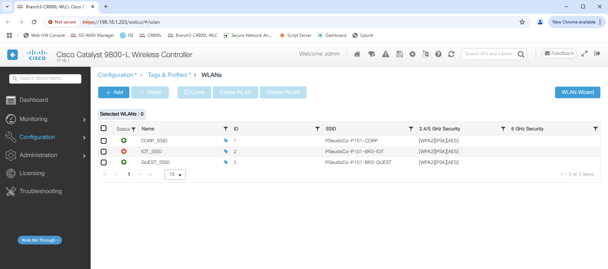
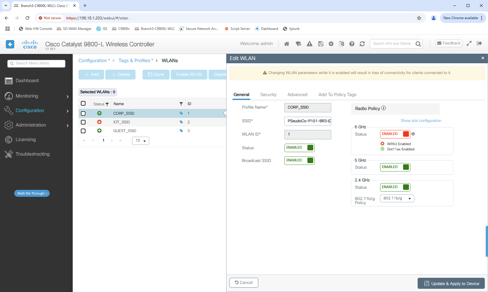

# dCloud Excercise

## Overview

The dCloud pod is already setup with SSIDs, but the SSIDs are different for every branch and every network. For this excercise, we will change the "Corporate" SSID to be the same for all sites, then maintain it moving forward.

## Steps

### Collecting Needed Values
#### After logging into dCloud, open a Web RDP session to the Jump Host
#### Open Chrome and navagate to `Dashboard` on the time line bookmarks
- Note `Meraki Org ID`
- Note `API Key`
#### Open the document named `SESSION_INFO` and look for the POD-specific SSIDs and PSKs:
- Look for `Yor POD-specific Wireless SSIDs:` (e.g. `PSeudoCo-P101-BR1-CORP`). You are pod 101 in this exmple
- Look for `PSK for Wireless SSIDs` and note the value.
### Running the Tooling
#### Options for a host from which to run the tooling
- Log in to the "Jump Host".  Using mRemoteNG, navigate to "Virtual Machines"->"Script Server"
- VPN into the pod using the information provided in "Info->AnyConnect Credentials" and run from your workstation
#### Clone this repo
```
% git clone https://github.com/cisco-dcloud-demo/campus-automation-demo.git
```
#### Open `mac-data/dcloud.yaml` in the repo:
- Change the `name` of ssid 1 to `PSeudoCo-P<Your POD number>-CORP` (i.e. Remove the `BR#`)
- Change the `psk` of ssid 1 to the PSK found in `SESSION_INFO`
- Change `meraki_org_id` to the value found in the "Dashboard" above
### Verify the starting state of the POD:
- On the "Jump Host", go to Chrome->Dashboard->Cisco Meraki->View
    - In the Meraki Dashboard, choose a networks (e.g. Branch1)
    - Choose Wireless->Configure->SSIDs
    - 
    - Network two should be `PSeudoCo-P101-BR1-CORP` if you are pod 101.  The `BR1` (if you chose the `Branch1` network) should be in the SSID.
- On the "Jump Host", go to Chrome->Branch3-C9800L-WLC
    - Log in with the POD credentials
    - Nagivate to Configuration->Tags & Profiles->WLANs
    - 
    - The Corpoorate SSID should be `PSeudoCo-P101-BR3-CORP`
### Now push the change out.
- set the  `MERAKI_DASHBOARD_API_KEY` environment variable.
    ```
    export MERAKI_DASHBOARD_API_KEY=XXXXXXXXXXXXXXXXXXXXXXXXXXXXXXXXXXXXXXXX`
    ```
- cd into `terraform/wireless`
- run `terraform init`

    ```
    % terraform init

    Initializing the backend...
    Initializing modules...

    Initializing provider plugins...
    - Reusing previous version of cisco-open/meraki from the dependency lock file
    - Reusing previous version of ciscodevnet/iosxe from the dependency lock file
    - Using previously-installed cisco-open/meraki v1.0.5-beta
    - Using previously-installed ciscodevnet/iosxe v0.5.6

    Terraform has been successfully initialized!

    You may now begin working with Terraform. Try running "terraform plan" to see
    any changes that are required for your infrastructure. All Terraform commands
    should now work.

    If you ever set or change modules or backend configuration for Terraform,
    rerun this command to reinitialize your working directory. If you forget, other
    commands will detect it and remind you to do so if necessary.
    ```
- run `terraform plan`.  You should see the two changes that the modules will make:
    ```
    Terraform will perform the following actions:

    # module.meraki.meraki_networks_wireless_ssids.this["L_618681998810023158-1"] will be updated in-place
    ~ resource "meraki_networks_wireless_ssids" "this" {
        ~ name                               = "PSeudoCo-P101-BR1-CORP" -> "PSeudoCo-P101-CORP"
        + radius_accounting_enabled          = (known after apply)
        + radius_accounting_servers_response = (known after apply)
        + radius_servers_response            = (known after apply)
            # (19 unchanged attributes hidden)
        }

    # module.wlc.iosxe_restconf.nested_list will be updated in-place
    ~ resource "iosxe_restconf" "nested_list" {
            id         = "Cisco-IOS-XE-wireless-wlan-cfg:wlan-cfg-data/wlan-cfg-entries"
        ~ lists      = [
            ~ {
                ~ items = [
                    - {
                        - "apf-vap-id-data/ssid"        = "PSeudoCo-P101-BR3-CORP"
                        - "apf-vap-id-data/wlan-status" = "true"
                        - "auth-key-mgmt-dot1x"         = "false"
                        - "auth-key-mgmt-psk"           = "true"
                        - "profile-name"                = "CORP_SSID"
                        - "psk"                         = "C1sco12345!"
                        - "wlan-id"                     = "1"
                        },
                    + {
                        + "apf-vap-id-data/ssid"        = "PSeudoCo-P101-CORP"
                        + "apf-vap-id-data/wlan-status" = "true"
                        + "auth-key-mgmt-dot1x"         = "false"
                        + "auth-key-mgmt-psk"           = "true"
                        + "profile-name"                = "CORP_SSID"
                        + "psk"                         = "C1sco12345!"
                        + "wlan-id"                     = "1"
                        },
                    ]
                    name  = "wlan-cfg-entry"
                    # (1 unchanged attribute hidden)
                },
            ]
            # (3 unchanged attributes hidden)
        }

    Plan: 0 to add, 2 to change, 0 to destroy.
    ```
- run `terraform apply`.  After you confirm the changes by typing `yes`, you should see it push out a change to the Meraki Dashboard and the WLC.
    ```
    Enter a value: yes

    module.meraki.meraki_networks_wireless_ssids.this["L_618681998810023158-1"]: Modifying... [name=PSeudoCo-P101-BR1-CORP]
    module.wlc.iosxe_restconf.nested_list: Modifying... [id=Cisco-IOS-XE-wireless-wlan-cfg:wlan-cfg-data/wlan-cfg-entries]
    module.wlc.iosxe_restconf.nested_list: Modifications complete after 1s [id=Cisco-IOS-XE-wireless-wlan-cfg:wlan-cfg-data/wlan-cfg-entries]
    module.meraki.meraki_networks_wireless_ssids.this["L_618681998810023158-1"]: Modifications complete after 1s [name=PSeudoCo-P101-CORP]

    Apply complete! Resources: 0 added, 2 changed, 0 destroyed.
    ```
### Verify the changes were made to the POD:
- On the "Jump Host", go to Chrome->Dashboard->Cisco Meraki->View
    - In the Meraki Dashboard, choose a networks (e.g. Branch2)
    - Choose Wireless->Configure->SSIDs
    - 
    - Network two should be `PSeudoCo-P101-BR2-CORP` if you are pod 101.  The `BR2` (if you chose the `Branch2` network) should be in the SSID.
- On the "Jump Host", go to Chrome->Branch3-C9800L-WLC
    - Log in with the POD credentials
    - Nagivate to Configuration->Tags & Profiles->WLANs
    - 
    - The Corpoorate SSID should be `PSeudoCo-P101-CORP`
- If you run `terraform plan` again, you should see no changes needed:
    ```
    % terraform plan 
    module.meraki.data.meraki_networks.this: Reading...
    module.wlc.data.meraki_devices.wlcs: Reading...
    module.wlc.data.meraki_organizations_wireless_controller_devices_interfaces_l3_by_device.example: Reading...
    module.meraki.data.meraki_networks.this: Read complete after 0s
    module.meraki.meraki_networks_wireless_ssids.this["L_618681998810023158-1"]: Refreshing state... [name=PSeudoCo-P101-CORP]
    module.meraki.meraki_networks_wireless_ssids.this["L_618681998810023448-1"]: Refreshing state... [name=PSeudoCo-P101-CORP]
    module.wlc.data.meraki_organizations_wireless_controller_devices_interfaces_l3_by_device.example: Read complete after 0s
    module.wlc.iosxe_restconf.nested_list: Refreshing state... [id=Cisco-IOS-XE-wireless-wlan-cfg:wlan-cfg-data/wlan-cfg-entries]
    module.wlc.data.meraki_devices.wlcs: Read complete after 0s

    No changes. Your infrastructure matches the configuration.

    Terraform has compared your real infrastructure against your configuration and found no differences, so no changes are needed.
    ```
### Make an out-of-band change and verify that Terraform cathes it.
- On the "Jump Host", go to Chrome->Branch3-C9800L-WLC
    - Log in with the POD credentials
    - Nagivate to Configuration->Tags & Profiles->WLANs
    - 
    - Change the Corpoorate SSID to `PSeudoCo-P101-BR3-CORP`
    - Hit `Update & Apply to Device`
- Run `terraform plan` and see that the change was detected:
    ```
    Terraform will perform the following actions:

    # module.wlc.iosxe_restconf.nested_list will be updated in-place
    ~ resource "iosxe_restconf" "nested_list" {
            id         = "Cisco-IOS-XE-wireless-wlan-cfg:wlan-cfg-data/wlan-cfg-entries"
        ~ lists      = [
            ~ {
                ~ items = [
                    - {
                        - "apf-vap-id-data/ssid"        = "PSeudoCo-P101-BR3-CORP"
                        - "apf-vap-id-data/wlan-status" = "true"
                        - "auth-key-mgmt-dot1x"         = "false"
                        - "auth-key-mgmt-psk"           = "true"
                        - "profile-name"                = "CORP_SSID"
                        - "psk"                         = "XXXXXXXXXXX"
                        - "wlan-id"                     = "1"
                        },
                    + {
                        + "apf-vap-id-data/ssid"        = "PSeudoCo-P101-CORP"
                        + "apf-vap-id-data/wlan-status" = "true"
                        + "auth-key-mgmt-dot1x"         = "false"
                        + "auth-key-mgmt-psk"           = "true"
                        + "profile-name"                = "CORP_SSID"
                        + "psk"                         = "XXXXXXXXXXX"
                        + "wlan-id"                     = "1"
                        },
                    ]
                    name  = "wlan-cfg-entry"
                    # (1 unchanged attribute hidden)
                },
            ]
            # (3 unchanged attributes hidden)
        }

    Plan: 0 to add, 1 to change, 0 to destroy.
    ```
- Run `terraform plan` to remediate the change and bring it back in-line with the desireced Terraform state.
    ```
    Plan: 0 to add, 1 to change, 0 to destroy.

    Do you want to perform these actions in workspace "dcloud"?
    Terraform will perform the actions described above.
    Only 'yes' will be accepted to approve.

    Enter a value: yes

    module.wlc.iosxe_restconf.nested_list: Modifying... [id=Cisco-IOS-XE-wireless-wlan-cfg:wlan-cfg-data/wlan-cfg-entries]
    module.wlc.iosxe_restconf.nested_list: Modifications complete after 1s [id=Cisco-IOS-XE-wireless-wlan-cfg:wlan-cfg-data/wlan-cfg-entries]

    Apply complete! Resources: 0 added, 1 changed, 0 destroyed.
    ```
